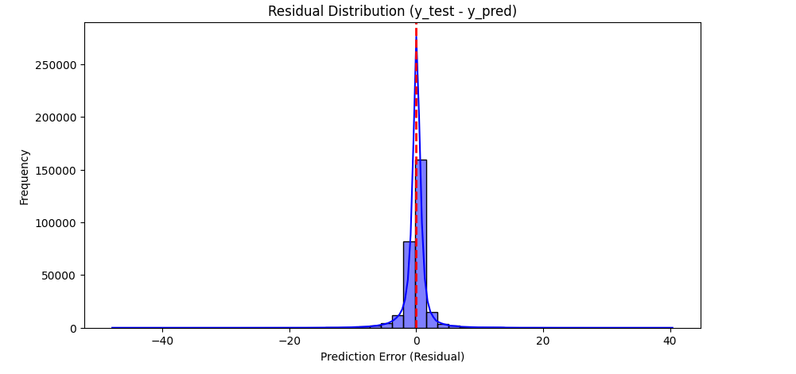

# 🚦 Traffic Speed Prediction using Machine Learning

## 📌 Project Overview

This project aims to predict traffic speed using time-series forecasting techniques. By leveraging XGBoost, the model forecasts future speeds based on historical sensor data. Accurate traffic speed prediction helps in traffic management, route optimization, and smart city planning.

## 📊 Dataset

* **Dataset:** METR-LA (Traffic speed sensor data in Los Angeles)
* **Type:** Time-series dataset with multiple sensors
* **Features Engineered:**
    * Timestamp-based Features: Hour, Day, Weekday, etc.
    * Rolling Statistics: Moving averages for trend analysis
    * Lag Features: Past values to predict future speeds

## 🎯 Objective

Predict the next time step's traffic speed for multiple sensors using ML models like XGBoost.

## 📈 Model Performance

| Metric    | Score          |
| :-------- | :------------- |
| MAE       | 1.0432 km/h    |
| RMSE      | 1.9093 km/h    |
| R² Score  | 0.9441         |
| MAPE      | 2.93%          |
| SMAPE     | 2.61%          |

✅ High accuracy with minimal errors makes this model useful for real-world applications.

## 🏗️ Tech Stack

* **Programming Language:** Python
* **Machine Learning Model:** XGBoost
* **Libraries Used:**
    * `pandas`, `numpy` (Data Processing)
    * `xgboost`, `sklearn` (Machine Learning)
    * `matplotlib`, `seaborn` (Visualization)

## 🚀 How to Run

1.  **Install Dependencies**

    ```bash
    pip install -r requirements.txt
    ```

2.  **Create required file**

    ```python
    python traffic_prediction.py
    ```

3.  **Load and use the Model**

    ```python
    import xgboost as xgb

    model = xgb.Booster()
    model.load_model("xgb_traffic_model.json")
    ```


## 📷 Screenshots

### **Residual plot:**
 

### **Comparison for Sensor 0:**
 

## 🔥 Key Features

* ✅ **Multi-Sensor Forecasting** – Predicts speed across multiple locations
* ✅ **Feature Engineering** – Uses lag features, rolling statistics, and time-based features
* ✅ **Optimized ML Model** – Fine-tuned XGBoost for best performance
* ✅ **Scalable** – Can be extended to include more real-world variables

## 📌 Future Improvements

* 📡 Integrate live traffic APIs for real-time forecasting
* 🗺️ Deploy as a web service for traffic management systems

## 📜 License

This project is open-source under the MIT License.